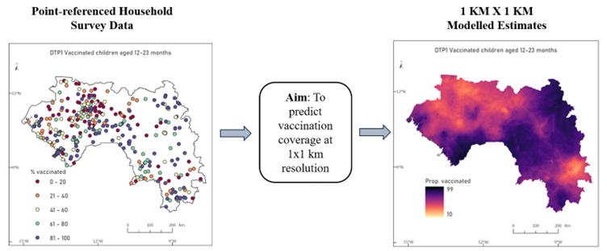
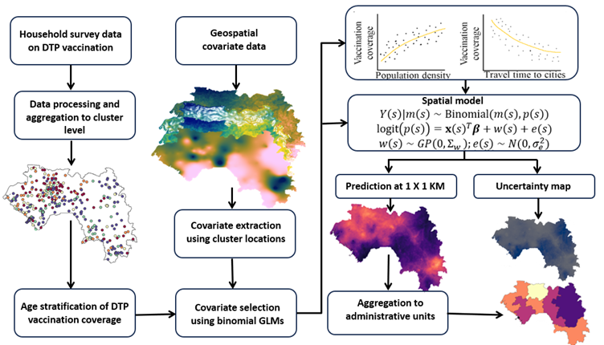
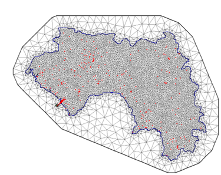

# RtU_vaccination_modelling
Reach the Unreached: Vaccination Modelling
This repository contains the methodology and R code used to analyze the DTP vaccination coverage for children aged 12-23 months in Guinea, based on the 2018 Guinea Demographic and Health Surveys (GDHS). The dataset consists of information from 7951 respondents across 401 survey cluster locations, focusing on vaccination coverage for DTP1-3. 

# Overview
Vaccination coverage is defined as the proportion of the target population that has been vaccinated in a given time period. Estimates of vaccination coverage can be obtained from administrative and official sources and household surveys. However, due to unreliable or incomplete routine data systems, nationally representative household surveys are commonly used in low- and middle-income countries to fill the data gaps that exist. Most surveys usually focus on providing data at the provincial or regional levels and not at smaller administrative levels like prefectures, where vaccination programmes are planned and carried out. This creates a challenge in assessing vaccination coverage at the local level. Geospatial modelling techniques can help solve this problem by creating estimates of indicators of as vaccination coverage at finer grid levels, such as 1x1 km. These estimates can then be aggregated, through weighting using population data, to provide estimates at various administrative levels. In this study, we use geospatial methods to estimate the coverage of three doses of the diphtheria-tetanus-pertussis (DTP1, DTP2 and DTP3) vaccine for Guinea at a 1x1 km resolution and for three different administrative levels. This approach allows for more accurate and localised information to improve vaccination programmes. The principal objective is illustrated in the figure below.

## Data
The dataset used in this study comes from the 2018 Guinea Demographic and Health Surveys (GDHS), which includes information on DTP1-3 vaccination status among children (The DHS Program – Guinea, 2018). The dataset contains 1133 variables and covers 7951 respondents from 401 survey cluster locations. Key information, such as unique identifiers, cluster IDs, interview month/year, and date of birth, were extracted for analysis. The age of the children included in the data ranges from 0 to 35 months, but the focus is on children aged 12-23 months, as this is the reference age for DTP vaccination coverage estimation. To ensure data accuracy, children who were deceased or had missing vaccination records were excluded from the analysis. The numbers of children surveyed and those vaccinated for each DTP dose were determined for the 12-23 month age group. 

## Prerequisites
- R programming environment
- Required R packages: `car`, `dplyr`, `ggplot2`, `gtools`, `INLA`, `MASS`, `maptools`, `Metrics`, `plyr`, `raster`, `reshape2`, `sf`, `sp`, `spdep`, `xtable`
    
## Methodology

The figure below depicts the steps taken to analyse DTP vaccination coverage:

### Vaccination Data Extraction
Household survey data on DTP vaccination was collected and processed at the cluster level. Data was then stratified by age groups to understand vaccination coverage across different child age ranges.

### Covariate Assembly, Processing and Selection
Geospatial covariate data, such as nightlight intensity and distance to cities, were extracted using the locations of survey clusters and the methodology described in Perez-Haydrich et al. (2013). Covariate selection was undertaken using binomial generalized linear models (GLMs) to identify important predictors of vaccination coverage.  
Relationships between vaccination coverage and covariates were visually analysed. Trends like higher coverage in densely populated areas or areas closer to cities were explored to guide the model design. Statistical analyses conducted to detect multicollinearity and eliminate redundant covariates.

### Model Fitting
Bayesian binomial geostatistical models were fitted using the integrated nested Laplace approximation (INLA) with stochastic partial differential equation (SPDE) approach. A ratio-based method ensured logical consistency in vaccination coverage probabilities: (Utazi et al., 2021, Utazi et al., 2022)
- p(DTP1)≥p(DTP2)≥p(DTP3)

### Prediction
The fitted model was used to predict vaccination coverage at a fine spatial resolution (1x1 km). An uncertainty map was also generated to highlight areas where predictions were less certain.

### Aggregation to Administrative Areas
Predicted vaccination coverage was aggregated using population-weighted averages to administrative units for better interpretability. These estimates were compared with direct survey results at regional levels to validate the model.

### Validation
K-fold cross-validation implemented to evaluate cluster-level predictions. Modelled estimates compared with direct survey estimates at the regional level.

## Instructions

### Step 1: Vaccination Data Extraction
This repository contains R script (`data_extract.R`) to process vaccination data for children using survey datasets. The script extracts relevant variables, calculates children's age in months, and processes vaccination data for all three DTP doses along with vaccination data for measles. Another R script (`DTP_data_extract.R`) processes vaccination data only for DTP1, DTP2, and DTP3 vaccines, grouped by different age sets for individual clusters. It calculates the total number of children and those vaccinated in each age group and exports the summarized results for further analysis.

The purpose of this script is to:
- Extract vaccination-related variables from survey datasets.
- Exclude rows with missing data.
- Compute children’s age in months.
- Create processed datasets for Measles and DTP vaccinations.
- Create predefined age sets (0-8, 9-11, 12-23, and 24-35 months) to categorize children.

The final processed output provides an overview of vaccination coverage across different age groups and clusters.

### Step 2: Covariate Assembly and Processing
Geospatial covariates, including travel time to urban areas and health facilities, nightlight intensity, distance to conflict locations, malaria prevalence and others were compiled from multiple sources. These datasets, originally available at varying spatial and temporal resolutions, were standardized into 1 × 1 km grids using geospatial software, with some data aggregated across years to capture long-term trends. Covariate values were then extracted for each cluster location to support the study analysis. Following the methodology outlined by Perez-Haydrich et al. (2013), potential displacement of cluster locations during covariate data extraction was addressed by creating 5 km and 2 km buffers for rural and urban areas, respectively. The mean values of continuous covariates were then calculated from the grid cells within these buffers.

Some additional covariates are extracted from the 2018 DHS dataset (The DHS Program – Guinea, 2018) to improve the predictive accuracy of the models. R script (`DHS_covariate_extract.R`) classifies proportional socio-economic data, like wealth index, education level, and health indicators. These variables are important in understanding public health and social inequalities. These data are linked to specific locations and provide insights into regional patterns. However, analysing such data is challenging because the values are bounded between 0 and 1 and can be unevenly distributed. This script uses kriging to analyse proportional data and predict values in areas without data. To make the data suitable for this method, a logit transformation is applied to stretch the values. Using the transformed data, kriging creates maps showing the spatial distribution of indicators across Guinea, based on DHS cluster data. These maps also include uncertainty estimates for the predictions. This approach helps reveal regional differences in wealth, education, and health, which can guide policies and resource allocation.

Principal purpose of this script is to create 1 × 1 km interpolated surfaces of the socio-demographic covariates (accessed from the DHS dataset) using kriging interpolation.

The 1 × 1 km gridded surface for the urban-rural covariate was constructed following the method outlined in (Dong & Wakefield, 2021) which integrated gridded population data from WorldPop (WorldPop, 2023) and urban population proportions for each administrative level one area within each state, derived from the 2018 DHS report (The DHS Program – Guinea, 2018). This operation is performed using the R script `rural_urban_class.R`.

Principal purpose of this script is to classify pixels on a 1 × 1 km population raster as urban or rural.

### Step 3: Covariate Selection
Statistical analyses were performed to check for multicollinearity among the covariates and to remove any covariates that were not statistically significant. R script (`covariate_selection.R`) processes and selects relevant covariates for analysing vaccination data by cleaning the data, handling missing values, and transforming skewed covariates. It then evaluates the predictive power of each covariate using statistical methods such as AIC and R-squared, checks for multicollinearity, and applies stepwise regression to select the most significant covariates. Variance Inflation Factor (VIF) was used to measure the level of collinearity. Covariates with a VIF greater than 5 were considered to have high multicollinearity and were removed from the analysis (O’Brien, 2007).

The principal purpose of this script is to detect multicollinearity and select significant covariates for the model.

### Step 4: Model Fitting, Prediction and Aggregation to Administrative Areas
This script (`model_dtp1.R`) is a statistical modelling workflow that applies Bayesian spatial modelling techniques using the INLA-SPDE approach with a binomial likelihood function and spatial random effects (Rue, Martino, & Chopin, 2009, Lindgren, 2012, Lindgren & Rue, 2015). It focuses on analysing vaccination data (DTP1 coverage) by combining geographical and socio-economic covariates, using spatial data (coordinates, raster layers, and shapefiles) to model the spatial variation in vaccination coverage across different regions. The approach includes mesh generation for spatial random effects, prediction of vaccination coverage across unobserved locations, and posterior sampling to obtain credible intervals for the predictions, which are then visualized and saved for further analysis.

The ratio-based (RB) approach models vaccination coverage by using ratios of consecutive doses to ensure the monotonicity constraint is met (Utazi et al., 2022). This technique confirms p(DTP1)≥p(DTP2)≥p(DTP3).

Following the above methodology, first, the script “model_dtp1.R” calculates the coverage of the first dose. Then, it models the ratio between the first and second doses using the script “model_dtp2_1.R”, and the second and third doses using the script “model_dtp3_2.R”. Next in scripts (model_estimate_dtp2 and model_estimate_dtp3) these ratios are used to estimate the coverage of each dose while ensuring that the coverage decreases with each subsequent dose. The approach uses ratios and avoids the sample size limitations of other methods, making it easier to apply in different contexts. For all the models the methodology is embedded within a Bayesian binomial geostatistical framework implemented using the INLA and SPDE approaches. The detailed methods can be found in these publications: (Utazi et al., 2021, Utazi et al., 2022).

Posterior samples are drawn from the models to obtain DTP1, DTP2, and DTP3 predictions at a 1 × 1 km resolution along with uncertainty estimates (mean, quantiles, SD). Next, aggregated to administrative areas using population-weighted averages. The population layer of females aged 15 to 49 was utilized for this weighting, reflecting the reproductive age group relevant to the analysis. These aggregated estimates, along with their corresponding confidence intervals and standard deviation were generated using the scripts.

### Step 5: Validation
K-fold cross-validation is used to evaluate cluster-level predictions by comparing modelled estimates with direct survey estimates at the cluster level as well as regional level. Posterior sampling is performed with 1,000 samples to estimate latent, spatial, and fixed effects, as well as hyperparameters. Both in-sample and out-of-sample validations are performed to assess the predictive accuracy of the model. DTP2 and DTP3 are not directly modelled indicators in the ratio-based approach; therefore, no cluster-level validation is shown for these doses. Validation is performed only for DTP1, the ratio of DTP2 to DTP1, and the ratio of DTP3 to DTP2, using the respective scripts `dtp1_validation.R`, `dtp2_1_validation.R`, and `dtp3_2_validation.R`. Metrics such as correlation, RMSE, and average bias were calculated during these validation steps. These analyses confirm how well the model fits the observed data and its ability to generalize to unseen data under different cross-validation splits.

## Acknowledgements
The Reach the Unreached – Digital technologies to map zero-dose and unreached children in West and Central Africa project is funded by UNICEF — The United Nations Children’s Fund (contract No. 43387656). The project is led by UNICEF West Africa Regional Office and the partners include the UNICEF Country Offices, WorldPop at the University of Southampton, MapAction, and CartONG.  
This method report was written by Somnath Chaudhuri and Edson Utazi. The contributions of the entire WorldPop team to the developed method and to the current applications are also acknowledged.

## Suggested citation
Chaudhuri S., Olowe I., Lazar A. N., Tatem A. J., Utazi C. E. 2024. Vaccination coverage estimates for Guinea (2023)

## License
This code and Readme document may be redistributed following the terms of a Creative Commons Attribution 4.0 International (CC BY 4.0) License.

## References
- Dong, T. Q., & Wakefield, J. (2021). Modeling and presentation of vaccination coverage estimates using data from household surveys. Vaccine, 39(18), 2584-2594.
- Lindgren, F. (2012). Continuous domain spatial models in R-INLA. The ISBA Bulletin, 19(4), 14-20.
- Lindgren, F., & Rue, H. (2015). Bayesian spatial modelling with R-INLA. Journal of statistical software, 63(19).
- O’brien, R. M. (2007). A caution regarding rules of thumb for variance inflation factors. Quality & quantity, 41, 673-690.
- Perez-Heydrich, C., Warren, J. L., Burgert, C. R., & Emch, M. (2013). Guidelines on the use of DHS GPS data. ICF International.
- Rue, H., Martino, S., & Chopin, N. (2009). Approximate Bayesian inference for latent Gaussian models by using integrated nested Laplace approximations. Journal of the Royal Statistical Society Series B: Statistical Methodology, 71(2), 319-392.
- The DHS Program. (2018). Guinea Standard DHS 2018. Retrieved from https://www.dhsprogram.com/data/dataset/Guinea_Standard-DHS_2018.cfm
- Utazi, C. E., Nilsen, K., Pannell, O., Dotse‐Gborgbortsi, W., & Tatem, A. J. (2021). District‐level estimation of vaccination coverage: Discrete vs continuous spatial models. Statistics in Medicine, 40(9), 2197-2211.
- Utazi, C. E., Aheto, J. M. K., Chan, H. M. T., Tatem, A. J., & Sahu, S. K. (2022). Conditional probability and ratio‐based approaches for mapping the coverage of multi‐dose vaccines. Statistics in Medicine, 41(29), 5662-5678.
- WorldPop. (2023). The WorldPop project. Retrieved from https://www.worldpop.org/
