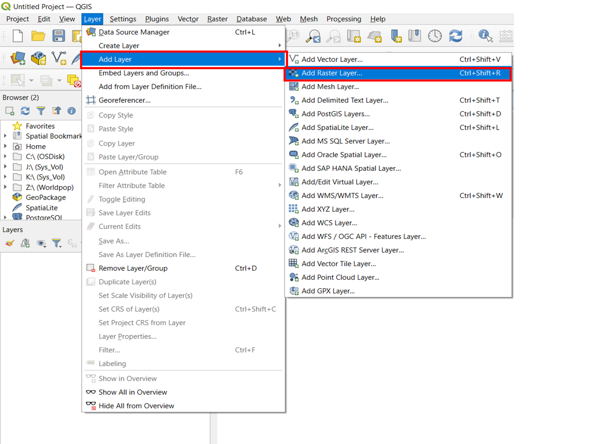
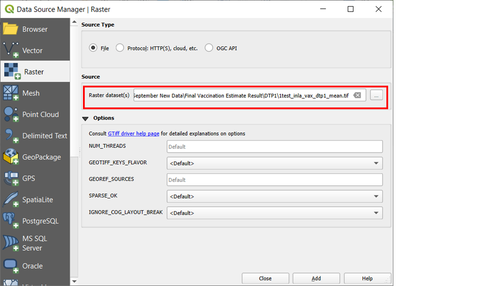
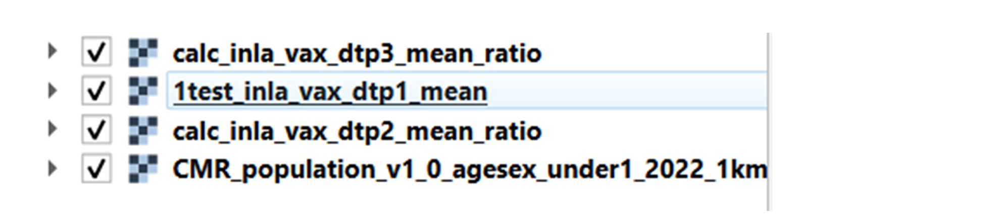
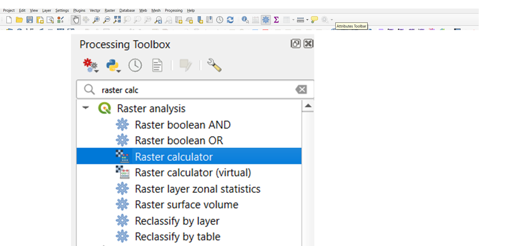
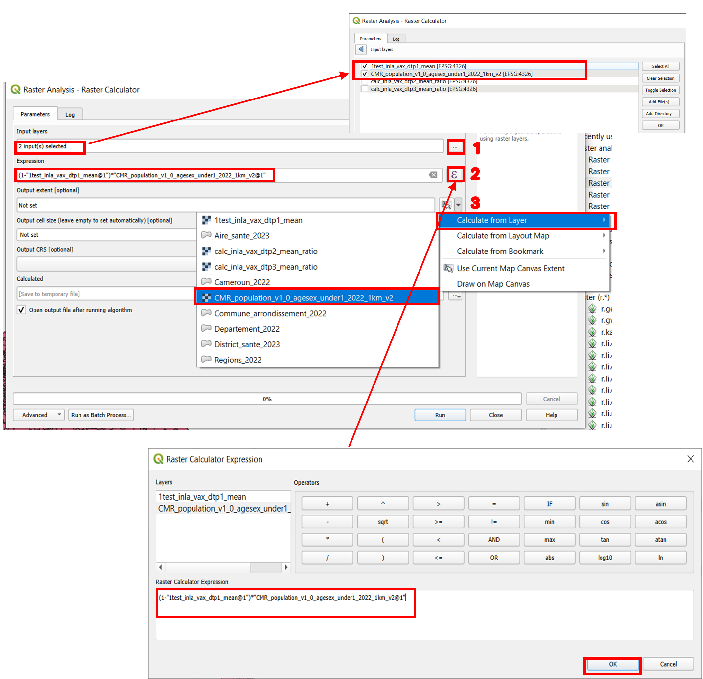

# Zero-Dose Estimation Using QGIS

This document depicts how to calculate the estimates of numbers of un and under-vaccinated children in Cameroon at the Commune Arrondissement administrative level.

## Required Files

1. **Population raster**
2. **Vaccination coverage rasters** (DTP1, DTP2, DTP3)
3. **Shapefile** defining the zones for estimation

## Required Tools

In QGIS software, the following tools are required:

- Raster Calculator
- Zonal Statistics

For this exercise, QGIS v3.40.0 was used.

## Adding Files to the Map Window

### Methods to Add Files
1. Navigate to the folders where the files are located, select them, and drag and drop them into the map window.
2. Add raster layers using the following steps:
   - Click the **Layer** tab on the **Menu Toolbar**.
   - Select **Add Layer** > **Add Raster Layer**.

   <div align="center">
   
   </div>

   - Click the three dots beside **Raster dataset(s)** to navigate to the files.
   - Add one or multiple files and click **Add** > **Close**. The files will be displayed in the map window and listed in the Layers panel.

3. Follow the same process to add the shapefile for Commune Arrondissement by selecting **Add Vector Layer** instead.

## Zero-Dose Calculation

Zero-dose calculations use a population-weighted aggregation with the formula:

```
(1 - Vaccination Coverage Raster) * Population Raster
```

### Steps to Perform Zero-Dose Calculation Using Raster Calculator
1. Navigate to the **Processing Toolbox** by clicking on the Attributes toolbar above the map window.
2. Search for **Raster Calculator** and double-click to open its panel.
3. Follow these instructions:
   - Click the three dots beside the **Input layers** box to select the vaccination raster and the population raster.
   - Open the Expression box (∑) and type:
     ```
     (1 - vaccination raster) * Population raster
     ```
   - Set an output extent by clicking the down arrow beside **Output extent [optional]** and selecting **Calculate from Layer**. Choose the Population layer.
   - Save the final output by clicking the three dots under the **Calculated** section and provide a meaningful name.
   - Leave other settings as default and click **Run**.

   <div align="center">
   
   </div>

4. Repeat the process for the remaining vaccination rasters (DTP2, DTP3). The outputs will be added to the map window.

## Estimation at Administrative Level

### Using Zonal Statistics
1. Open the **Processing Toolbox** and search for **Zonal Statistics**.
2. Configure the Zonal Statistics tool:
   - Set the **Input Layer** to the shapefile.
   - Set the **Raster Layer** to one of the zero-dose rasters (e.g., DTP1 zero-dose raster).
   - Set the **Output Column Prefix** to a meaningful name (e.g., `dtp1_`).
   - Under **Statistics to Calculate**, select **Sum**.

   <div align="center">
   
   </div>

3. Click **Run**. A new layer called **Zonal Statistics** will be added. Right-click it to open the attribute table and verify that a new field (e.g., `dtp1_sum`) has been added.
4. Repeat the process for DTP2 and DTP3 zero-dose rasters, updating the prefix (e.g., `dtp2_`, `dtp3_`). Remove older layers by right-clicking and selecting **Remove Layer**.

### Editing Field Names
1. Open the attribute table for the final Zonal Statistics layer.
2. Double-click the layer, navigate to **Fields**, and enable editing mode.
3. Update field names to include years.
4. Save the changes and stop editing.

   <div align="center">
   
   </div>

### Exporting the Final Layer
1. Right-click the final Zonal Statistics layer and select **Export** > **Save Features As**.
2. In the export window:
   - Select **ESRI Shapefile** or **Comma Separated Value [CSV]** under **Format**.
   - Navigate to the preferred folder and save the file.

   <div align="center">
   
   </div>

## Notes
The above steps can be repeated for any administrative areas.


## Acknowledgements
The Reach the Unreached – Digital technologies to map zero-dose and unreached children in West and Central Africa project is funded by UNICEF — The United Nations Children’s Fund (contract No. 43387656). The project is led by UNICEF West Africa Regional Office and the partners include the UNICEF Country Offices, WorldPop at the University of Southampton, MapAction, and CartONG.  
This method report was written by Somnath Chaudhuri and Edson Utazi. The contributions of the entire WorldPop team to the developed method and to the current applications are also acknowledged.


## License
This code and Readme document may be redistributed following the terms of a Creative Commons Attribution 4.0 International (CC BY 4.0) License.
